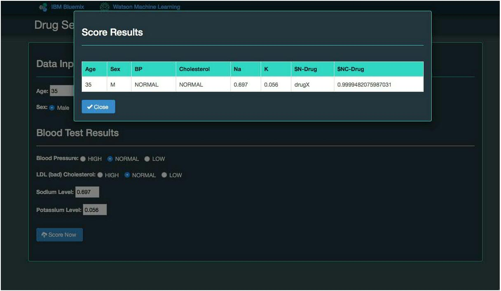
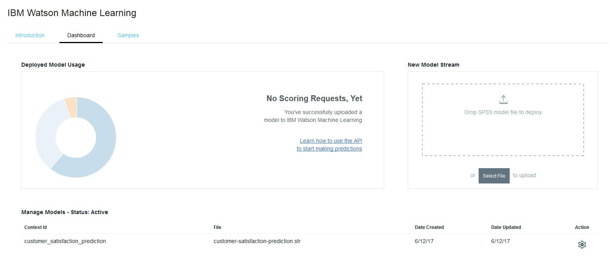

# About

A Telco Company wants to know which customers are at risk of leaving. 
The presented model predicts Telco customer churn.

# Prequisities

Model available in \model subdirectory (customer-satifaction-prediction.str) has to be uploaded to the Watson Machine Learning instance using Dashboard (drop box). Make sure that uploaded model is named correctly (contextID=customer_satisfaction_prediction).

customer-satisfaction-prediction.str --> customer_satisfaction_prediction

For reference please see screenshot below.

After successful models upload deployed application should provide scoring capability as shown below.

